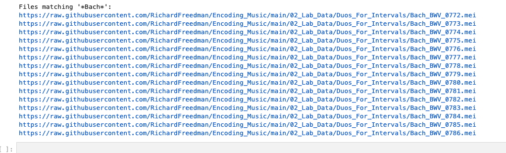

# MEI File Importing for CRIM Intervals Notebooks

`mei_import_tools.py` is a script that will help you import MEI files directly from github for use with CRIM Intervals Notebooks.

### Step 1:  Installation

From your virtual environment, install `mei_import_tools` as follows:

```python
pip install git+https://github.com/RichardFreedman/intervals_mei_tools.git
```

If you previously installed the tools and need to update:

```python
pip install --force-reinstall git+https://github.com/RichardFreedman/intervals_mei_tools.git@main
```

Check installation:

```python
python -c "from mei_import_tools import GitHubFileManager; print(GitHubFileManager.__module__)"
```


### Step 2:  Use in Your Notebook

Include this code as part of your import statements:

```python
from mei_import_tools import GitHubFileManager, GitHubConfig
```

When you are ready to load remote files:  

```python
# define the 'base' repository--your files should be here.  For example:
base_url = "https://github.com/RichardFreedman/Encoding_Music"

# invoke the file manager by passing that base url to the tool
manager = GitHubFileManager(base_url)

# this will return a LIST OF URLS, which you can in turn sort or slice to find the ones you need
```

Here are some sample sets, based on the contents of the main github `base_url` used above:

```python

# List all files
print("All files:")
urls = manager.list_files("02_Lab_Data/Duos_For_Intervals")
for url in urls:
    print(url)

# List files matching pattern
print("\nFiles matching '*Bach*':")
bach_urls = manager.list_files("02_Lab_Data/Duos_For_Intervals", patterns=['*Bach*'])
for url in bach_urls:
    print(url)
```
Sample result (of course you don't need to print them in the notebook!)




Now you can use these in various functions:

One piece:

`piece = importScore(bachurls[0])`

Or a set of them:

`corpus = CorpusBase(bach_urls)`